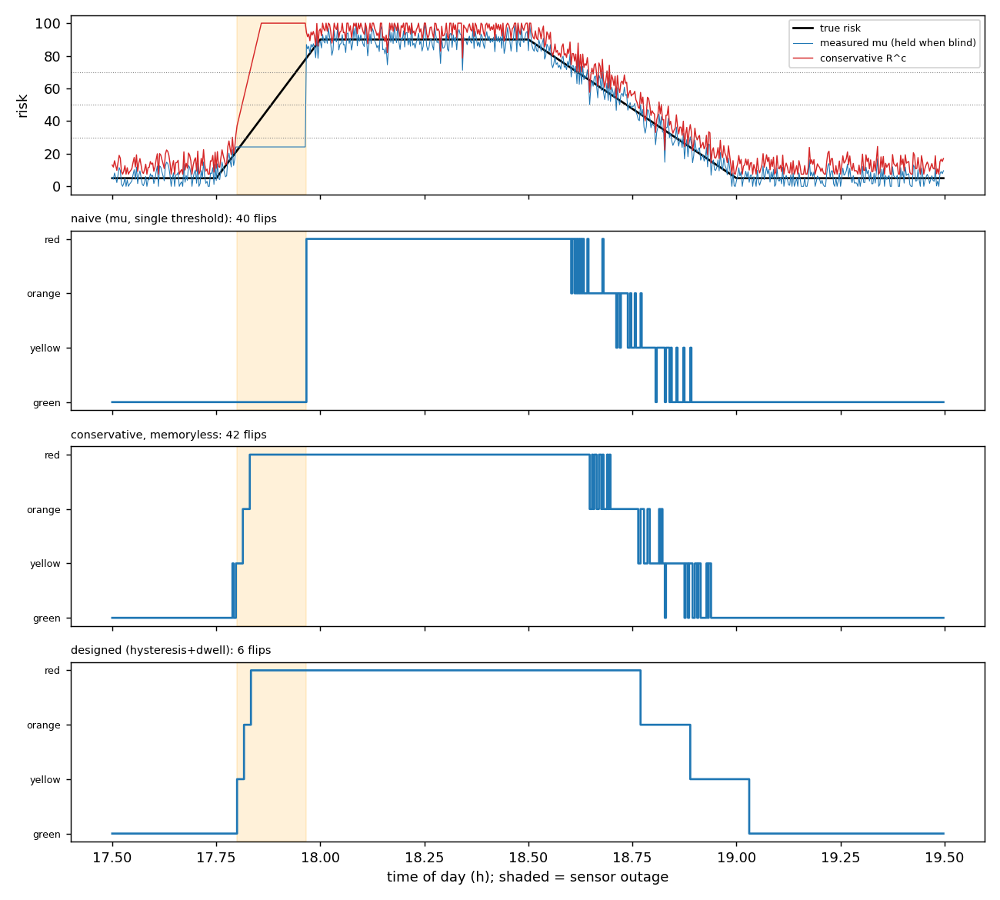

# Dynamic Geofencing for AVs: hysteresis simulation

Supporting simulation for ED5012 Mid-Semester, Problem 6 (*Location-Intelligence-Driven Dynamic Geofencing for Autonomous Vehicles in a Mixed-Traffic City*). It backs Task 6 (oscillation test) and Task 7 (sensor outage) of the written answer.

**All data is synthetic.** It illustrates the state-machine logic; it does not prove real-world performance.

## Run

```bash
pip install numpy matplotlib
python sim.py        # prints the metrics table, writes results.png
```

The seed is fixed, so results are reproducible. The script asserts that the designed policy beats both baselines.

## Interactive demo

`index.html` is a dependency-free JS port of `sim.py` with sliders for every threshold, dwell time, k, noise and the outage window. Open it locally, or enable GitHub Pages (Settings > Pages > deploy from `main`, root). At default settings and noise seed 0 it reproduces the results table below exactly (the numpy noise sequence is embedded).

## Scenario

One road segment, 17:30-19:30. True risk (0-100) is 5 on a quiet road, ramps to 90 between 17:45 and 18:00 (crowd surge), holds until 18:30, then decays to 5 by 19:00. Sensor noise is 5 points. Sensors are blind from 17:48 to 17:58, during the ramp-up; the last reading is held and the system is not told it is stale.

## Policies compared

| Policy | Rule |
|---|---|
| Naive | State from the raw reading, single threshold per level, no memory |
| Conservative, memoryless | State from R^c = 100 min(1, mu + k sigma), no memory |
| Designed | R^c plus the rules below |

Designed policy (parameters from the submitted document):

- States: green / yellow / orange / red; enter at R >= 30 / 50 / 70.
- Persistence: routine escalation needs two consecutive 10 s cycles above the threshold.
- Release thresholds 20 / 40 / 60, held for 180 / 120 / 120 s (yellow->green, orange->yellow, red->orange), one level at a time.
- Minimum dwell of 60 s between routine transitions.
- Urgent bypass: R >= 85 escalates immediately.
- Uncertainty: sigma = 0.05 + 0.0015 x seconds since last reading; k = 1.5 (good coverage), 2.0 (blind).
- Blind beside the stadium: R^c floored at 50 (at least orange).

## Results

| Policy | Flips | Dwell violations | Unsafe exposure (s) | Over-restriction (s) | Red lag (s) |
|---|---|---|---|---|---|
| Naive | 40 | 33 | 120 | 0 | 90 |
| Conservative, memoryless | 42 | 36 | 0 | 220 | -400 |
| Designed | 6 | 0 | 0 | 480 | -390 |

- Unsafe exposure: seconds with true risk >= 70 while the state is below red.
- Over-restriction: seconds in orange/red while true risk < 40 (the efficiency cost).
- Red lag: first red minus first time true risk >= 70; negative means red came early.



Reading it: the designed policy makes a single green -> yellow -> orange -> red -> orange -> yellow -> green pass with no dwell violations. During the outage the naive policy holds a stale low reading and misses the hazard; the designed policy inflates sigma as data goes stale and restricts early. That early restriction is the safety-vs-efficiency price (480 s over-restriction vs 220 s).

## Limitations

- Single segment, synthetic signal, one noise model, one seed.
- Sensitivity: the quiet-road conservative score (about 5 + 1.5 sigma = 12.5) sits only 7.5 points under the yellow release threshold of 20. With a baseline true risk of 10 the score hovers near 17.5, noise keeps resetting the 180 s timer, and the segment stays yellow. The thresholds need calibration against real data.
- No spatial graph, ML model, polygon generation, PKI or blockchain; those are covered in the written answer only.
